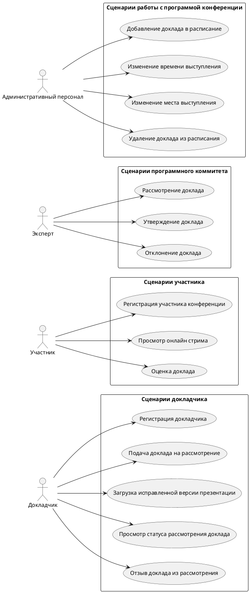

# Описание требований и архитектуры

## Введение
<!-- Общее краткое описание создаваемой системы -->
В рамках курса осуществляется проектирование решения на основе [постановки задачи от "заказчика"](../task.md).

- [Описание требований и архитектуры](#описание-требований-и-архитектуры)
  - [Введение](#введение)
  - [Заинтересованные стороны](#заинтересованные-стороны)
  - [Бизнес-контекст (бизнес-требования)](#бизнес-контекст-бизнес-требования)
    - [Предпосылки](#предпосылки)
    - [Цели и задачи](#цели-и-задачи)
  - [Глоссарий](#глоссарий)
  - [Модель предметной области](#модель-предметной-области)
  - [Требования к системе](#требования-к-системе)
    - [Сценарии использования (Use case)](#сценарии-использования-use-case)
    - [Функциональные требования](#функциональные-требования)
    - [Нефункциональные требования/Требования к атрибутам качества](#нефункциональные-требованиятребования-к-атрибутам-качества)
    - [Ограничения](#ограничения)
  - [Архитектура](#архитектура)
    - [Журнал архитектурных решений](#журнал-архитектурных-решений)
    - [Контекст решения](#контекст-решения)
    - [Компонентная архитектура](#компонентная-архитектура)
    - [Реализация сценариев использования](#реализация-сценариев-использования)
    - [Программные интерфейсы](#программные-интерфейсы)
    - [Схема развертывания](#схема-развертывания)
  
## Заинтересованные стороны
<!-- Перечень заинтересованных сторон и их интересов по отношению к создаваемой системе. 
Подробнее: https://confluence.mts.ru/pages/viewpage.action?pageId=399975538 
-->
| Заинтересованная сторона           | Интересы                                                                                                      |
| :--------------------------------- | :------------------------------------------------------------------------------------------------------------ |
| Участники                          | Посещение конференции, позитивный пользовательский опыт, отсутствие проблем в процессе проведения конференции |
| Докладчики                         | Выступление с докладом перед широкой аудиторией, отсутствие технических проблем и накладок                    |
| Программный комитет                | Выбор интересных докладов, обратная связь с докладчиками, формирование расписания конференции                 |
| Руководитель проекта               | Выполнение проекта в срок, без превышения бюджета и изменения содержания                                      |
| Команда разработки                 | Разработка и запуск программной системы, получение премий и эйфории от вывода системы на прод :)              |
| Команда технической поддержки      | Отсутствие багов и стабильная работа системы                                                                  |
| Команда эксплуатации               | Детерминированное поведение системы, надежность системы, возможность масштабирования, отсутствие аварий       |
| Руководитель конференции           | Успешное проведение конференции, высокая степень удовлетворенности участников                                 |
| Команда организации конференции    | Успешное проведение конференции, скорость и качество выполнения работ по организации конференции              |
| Топ менеджмент                     | Успешное проведение конференции, повышение узнаваемости бренда, повышение лояльности к компании               |
| Маркетологи                        | Продвижение бренда, получение информации об аудитории и её интересах, обратная связь с аудиторией             |
| Партнеры конференции               | Продвижение своих продуктов и брендов среди участников конференции                                            |
| Служба информационной безопасности | Отсутствие утечек персональных данных и другой конфиденциальной информации                                    |
| Гос. регулятор                     | Соответствие системы требованиям законодательства в области работы с персональными данными                    |

## Бизнес-контекст (бизнес-требования)
<!-- Общее описание бизнес-контекста создаваемой системы (автоматизируемой деятельности), список бизнес-целей заинтересованных сторон 
Подробнее: https://confluence.mts.ru/pages/viewpage.action?pageId=399973845
-->

### Предпосылки
Для проведение конференции helloconf.mts.ru необходимо из множества возможных докладов выбрать наиболее качественные и интересные для посетителей конференции доклады.

Из-за большого количество докладов, работа с ними в ручном режиме неэффективна. Множественные каналы коммуникации с желающими выступить с докладом усложняют процесс работы с обратной связью.

Формирование программы конференции в ручном режиме является сложной задачей, т.к. необходимо учитывать тайминги докладов и количество одновременных сессий (например 3 зала, в которых одновремено идут 3 разных доклада), а так же отсутствие пересечений.

### Цели и задачи

* BR.001 Сокращение времени оценки, корректировки и утверждения докладов для программы конференции
* BR.002 Создание корректной программы конференции, с равномерной загрузкой залов и без пересечений по времени
* BR.003 Привлечение максимального количества участников путем проведения онлайн-трансляции конференции
* BR.004 Получение аналитической информации об аудитории для дальнейшего использования в маркетинговых кампаниях
* BR.005 Повышение узнаваемости бренда

## Глоссарий
<!-- Содержит основные понятия и термины предметной области  
Подробнее: https://confluence.mts.ru/pages/viewpage.action?pageId=375782595
-->
| Понятие               | Сокращение | Определение                                                                                                                                                 |
| :-------------------- | :--------- | :---------------------------------------------------------------------------------------------------------------------------------------------------------- |
| Доклад                | -          | Совокупность темы выступления, ФИО спикера, а так же презентации                                                                                            |
| Презентация           | -          | Файл с набором слайдов, содержащих текстовую и графическую информацию информация                                                                            |
| Участник              | -          | Человек, принимающий участие в конференции                                                                                                                  |
| Программный комитет   | -          | Группа людей, утверждающих доклады и формирующих программу конференции                                                                                      |
| Эксперт               | -          | Участник программного комитета                                                                                                                              |
| Докладчик             | -          | Участник конференции, выступающий перед другими участниками с утвержденными программным комитетом докладами                                                 |
| Зал                   | -          | Помещение (в т.ч. виртуальное), в котором проходит выступление                                                                                              |
| Трансляция            | -          | Совокупность видео и аудио потока, транслируемых из зала, а так же пользовательский чат                                                                     |
| Программа конференции | -          | Множество докладов и залов, распределенных по временным слотам                                                                                              |
| Временной слот        | -          | Зарезервированный период времени, в течение которого зал забронирован для выступления докладчика                                                            |
| Подача доклада        | -          | Процесс регистрации доклада для последующего утверждения программным комитетом                                                                              |
| Рассмотрение доклада  | -          | Процесс изучения доклада на предмет соответствия тематике конференции, оценка качества доклада, принятие решения об утверждении и подготовка обратной связи |
| Утверждение доклада   | -          | Процесс включения доклада в программу конференции                                                                                                           |
| Обратная связь        | -          | 1. Информирование докладчика о результатах рассмотрения его доклада программным комитетом                                                                   |
|                       |            | 2. Оценка участником конференции одного или нескольких докладов                                                                                             |
| Оценка                | -          | Оценка доклада по шкале от 1 до 5, где 1 - ужасно, 5 - отлично                                                                                              |

## [Модель предметной области](data/data.md)

## Требования к системе

### Сценарии использования (Use case)
<!-- Подробное описание сценариев использования системы с привязкой к ролям участников и задействованным бизнес-сущностям 
https://confluence.mts.ru/pages/viewpage.action?pageId=375782108 
https://confluence.mts.ru/pages/viewpage.action?pageId=375782119 
-->
#### Диаграмма сценариев использования (Use Case Diagram) <!-- omit in toc -->

#### Список сценариев использования <!-- omit in toc -->

| ID     | Описание                                                   |
| ------ | ---------------------------------------------------------- |
| UC.001 | *[Регистрация докладчика](uc/uc.001.md)*                   |
| UC.002 | *[Подача доклада на рассмотрение](uc/uc.002.md)*           |
| UC.003 | *[Загрузка исправленной версии презентации](uc/uc.003.md)* |
| UC.004 | *[Просмотр статуса рассмотрения доклада](uc/uc.004.md)*    |
| UC.005 | *[Отзыв доклада из рассмотрения](uc/uc.005.md)*            |
| UC.006 | *[Рассмотрение доклада](uc/uc.006.md)*                     |
| UC.007 | *[Утверждение доклада](uc/uc.007.md)*                      |
| UC.008 | *[Отклонение доклада](uc/uc.008.md)*                       |
| UC.009 | *[Добавление доклада в расписание](uc/uc.009.md)*          |
| UC.010 | *[Изменение времени выступления](uc/uc.010.md)*            |
| UC.011 | *[Изменение места выступления](uc/uc.011.md)*              |
| UC.012 | *[Удаление доклада из расписания](uc/uc.012.md)*           |
| UC.013 | *[Регистрация участника конференции](uc/uc.013.md)*        |
| UC.014 | *[Просмотр онлайн стрима](uc/uc.014.md)*                   |
| UC.015 | *[Оценка доклада](uc/uc.015.md)*                           |

### Функциональные требования
<!-- Описание требований к функциям, реализуемым системой. Требование может быть привязано к сценарию использования или быть общим 
Подробнее: https://confluence.mts.ru/pages/viewpage.action?pageId=375782501 
-->
| ID     | Функциональное требование                                                                                           |
| ------ | ------------------------------------------------------------------------------------------------------------------- |
| FR.001 | Как докладчик, я хочу зарегистрироваться на конференции в качестве докладчика                                       |
| FR.002 | Как докладчик, я хочу авторизироваться по EMail и паролю, чтобы войти в личный кабинет                              |
| FR.003 | Как докладчик, я хочу подать доклад на рассмотрение программным комитетом, чтобы выступить перед аудиторией         |
| FR.004 | Как докладчик, я хочу видеть список докладов, которые я подавал на рассмотрение                                     |
| FR.005 | Как докладчик, я хочу видеть статус рассмотрения моего доклада программным комитетом                                |
| FR.006 | Как докладчик, я хочу загрузить исправленную версию презентации доклада, чтобы продолжить рассмотрение доклада      |
| FR.007 | Как докладчик, я хочу отозвать доклад с рассмотрения, если я передумал выступать на конференции                     |
| FR.008 | Как докладчик, я хочу получать уведомления об утверждении или отклонении моего доклада                              |
| FR.009 | Как эксперт, я хочу видеть список докладов, которые необходимо рассмотреть                                          |
| FR.010 | Как эксперт, я хочу авторизироваться по EMail и паролю, чтобы войти в личный кабинет                                |
| FR.011 | Как эксперт, я хочу взять доклад на рассмотрение, чтобы решить, можно ли допустить доклад на конференцию            |
| FR.012 | Как эксперт, я хочу утвердить доклад, чтобы он мог быть включен в программу конференции                             |
| FR.013 | Как эксперт, я хочу отклонить некачественный доклад, чтобы он не мог быть включен в программу конференции           |
| FR.014 | Как эксперт, я хочу дать обратную связь докладчику, чтобы он понимал причину утверждения или отклонения доклада     |
| FR.015 | Как администратор, я хочу видеть расписание выступлений                                                             |
| FR.016 | Как администратор, я хочу добавить доклад в расписание конфереции, чтобы он был виден в расписании                  |
| FR.017 | Как администратор, я хочу изменить время выступления                                                                |
| FR.018 | Как администратор, я хочу изменить место выступления                                                                |
| FR.019 | Как администратор, я хочу удалить доклад из расписания, чтобы заменить его другим докладом                          |
| FR.020 | Как участник, я хочу зарегистрироваться на конференции в качестве участника, чтобы смотреть выступления докладчиков |
| FR.021 | Как участник, я хочу авторизироваться по EMail и паролю, чтобы войти в личный кабинет                               |
| FR.022 | Как участник, я хочу видеть программу конференции, чтобы запланировать посещение интересных мне выступлений         |
| FR.023 | Как участник, я хочу иметь возможность посмотреть выступление онлайн                                                |
| FR.024 | Как участник, я хочу оценить просмотренный доклад, чтобы дать обратную связь организаторам конференции              |

### Нефункциональные требования/Требования к атрибутам качества
<!-- Требования к основным архитектурным характеристикам (атрибутам качества) системы - надежность, масштабируемость, ИБ, и др.
Подробнее: https://confluence.mts.ru/pages/viewpage.action?pageId=375782530
-->
| ID     | Атрибут качества            | Описание требования                                                                                     |
| ------ | --------------------------- | ------------------------------------------------------------------------------------------------------- |
| QR.001 | Производительность          | 1. Система должна поддерживать одновременную работу не менее 100 докладчиков и 10 экспертов             |
|        |                             | 2. Система должна поддерживать одновременную работу не менее 5000 участников конференции                |
|        |                             | 3. Система должна исполнять 95% типовых запросов за время не более 3 секунд                             |
|        |                             | 4. Система должна сохранять показатели качества при одновременной онлайн транляции из не менее 3 залов  |
| QR.002 | Масштабируемость            | Система должна увеличивать производительность за счет горизонтального масштабирования                   |
| QR.003 | Надежность                  | 1. Система должна допускать сбои без ущерба безопасности данных не более чем в 5% обращений             |
|        |                             | 2. Система должна восстанавливаться после сбоя не более чем за 3 минуты                                 |
| QR.004 | Доступность                 | Система должна удовлетворять следующим параметрам доступности:                                          |
|        |                             | 1. В рабочее время (будние дни, с 9 до 18 часов по Мск) - 95%                                           |
|        |                             | 2. Во дни проведения конференции - 99%                                                                  |
|        |                             | 3. В выходные и праздничные дни, а так же в нерабочее время - требований не предъявляется               |
|        |                             | 4. Время простоя в работе системы не превышает 10 минут в день                                          |
| QR.005 | Информационная безопасность | 1. Система должна предотвращать несанкционированный доступ к персональным данным                        |
|        |                             | 2. Система должна использовать шифрование для хранения и передачи данных                                |
| QR.006 | Переносимость               | Система должна иметь возможность развертываться и запускаться на всех современных операционных системах |

### Ограничения
<!-- Описываются ограничения, оказывающие влияние на архитектуру системы - временные, финансовые, технологические
Подробнее: https://confluence.mts.ru/pages/viewpage.action?pageId=375782592
-->
| ID     | Ограничение                                                                            |
| ------ | -------------------------------------------------------------------------------------- |
| AC.001 | Система должна работать в Chrome 94.0 и выше, Firefox 112.0 и выше, Safari 15.0 и выше |
| AC.002 | Система должна использовать протокол HTTPS                                             |

## Архитектура

### Журнал архитектурных решений
<!-- Записи о ключевых принятых архитектурных решениях (ADR) для реализации архитектурно-значимых требований.
Подробнее: https://confluence.mts.ru/pages/viewpage.action?pageId=421162308
-->
- [ADR.NNN Суть решения](adr/adr-template.md)

### [Контекст решения](context/context.md)

### [Компонентная архитектура](components/components.md)

### Реализация сценариев использования
<!-- Реализация сценариев использования на основе взаимодействия компонентов системы и внешних систем/участников.
Диаграммы последовательности (UML Sequence diagram) и текстовое описание.

Подробнее: 
https://confluence.mts.ru/pages/viewpage.action?pageId=399442132
https://confluence.mts.ru/pages/viewpage.action?pageId=399442170
-->
| ID     | Описание                          | Реализация                                    |
| ------ | --------------------------------- | --------------------------------------------- |
| UC.001 | *Название сценария использования* | [Реализация сценария](uc-impl/uc.001-impl.md) |

### Программные интерфейсы
<!-- Спецификации публичных API системы и ее компонентов (синхронных, событийных). Создается на основе модели предметной области для реализации сценариев использования. 
  Форматы: OAS/Swagger, GraphQL, AsyncAPI/CloudEvents
-->
| Компонент             | Интерфейс                                      |
| :-------------------- | :--------------------------------------------- |
| *Название компонента* | *[Название интерфейса](api/service-name.yaml)* |

### [Схема развертывания](deployment/deployment.md)
